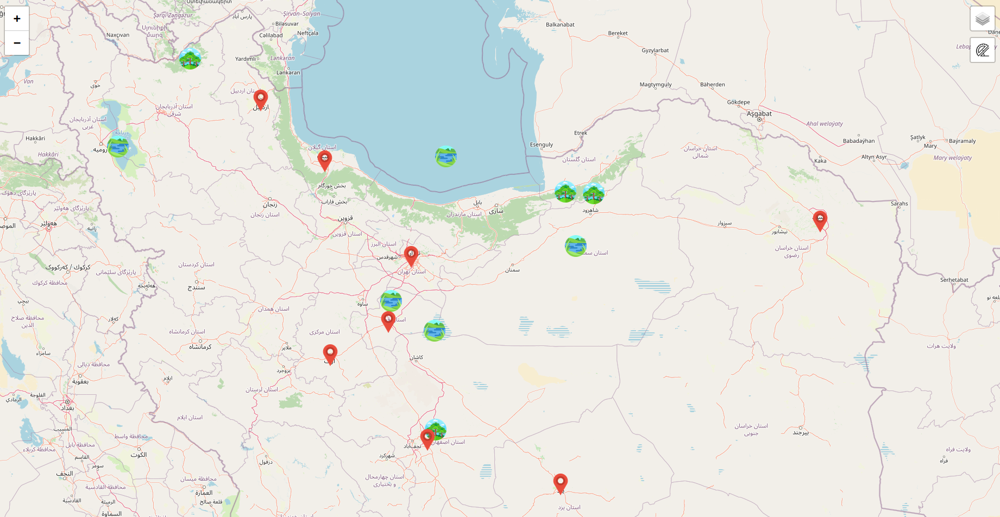

# Map JavaScript Project Structure

## Table of Content

- [Map JavaScript Project Structure](#map-javascript-project-structure)
  - [Table of Content](#table-of-content)
  - [About](#about)
    - [Features](#features)
    - [Project Structure](#project-structure)
  - [Getting Started](#getting-started)
    - [Using Git (recommended)](#using-git-recommended)
    - [Using manual download ZIP](#using-manual-download-zip)
    - [Development](#development)
  - [Screenshot](#screenshot)

## About

### Features

1. [JavaScript](https://www.javascript.com)
2. [HTML](https://html.com/)
3. [CSS](https://www.w3schools.com/css/)
4. Other tools/libraries/features
   - [Leafletjs](https://leafletjs.com/)
   - [ESLint](https://eslint.org/)
   - [Prettier](https://eslint.org/)

### Project Structure

```shell

├── img
│   ├── Arak.png
│   ├── Ardebil.png
│   └── ...
├── index.html
├── map.js
├── styles.css
└── README.md
```

## Getting Started

### Using Git (recommended)

1- Clone the project from github.

```
git clone https://github.com/....
```

### Using manual download ZIP

1- Download repository

2- Uncompress to your desired directory

### Development

run the HTML on a browser.

## Screenshot


